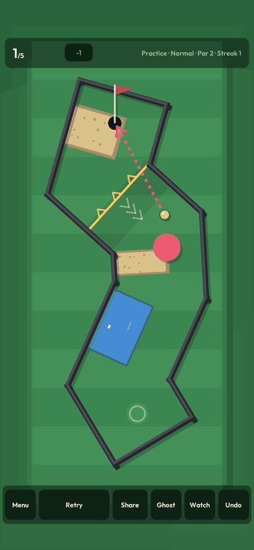
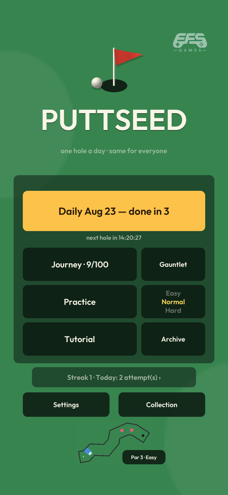
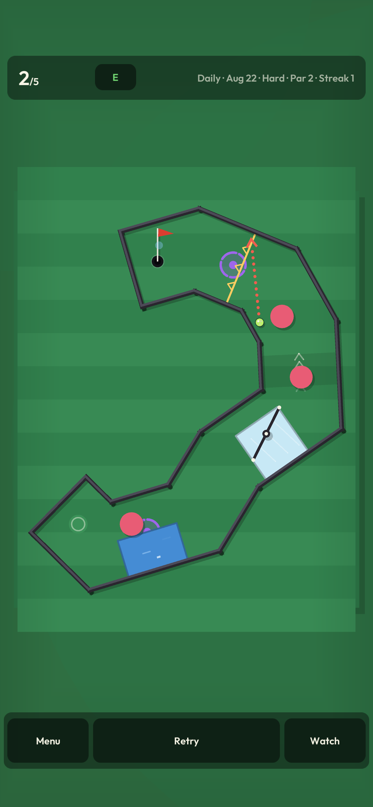
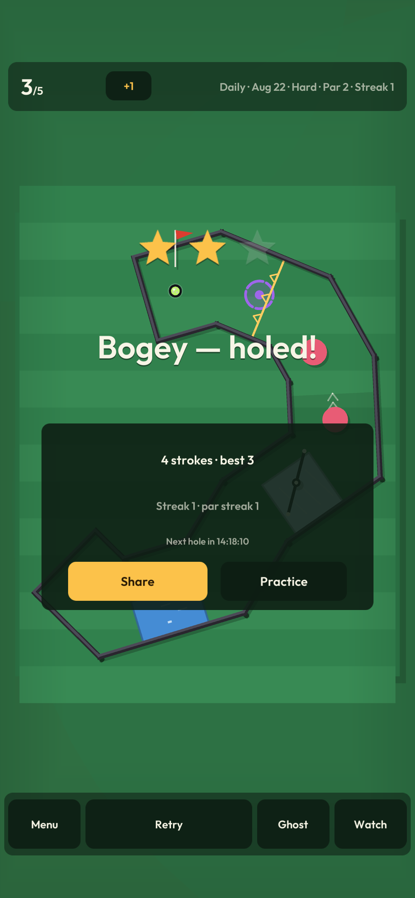
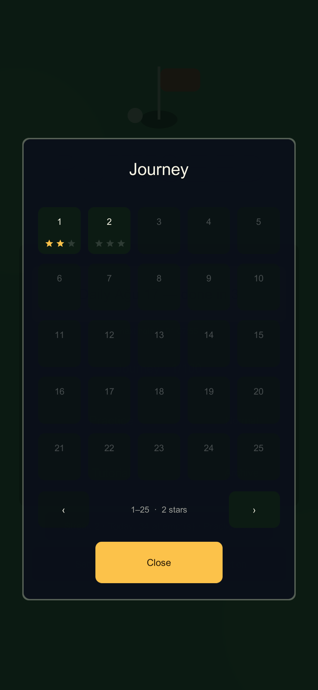
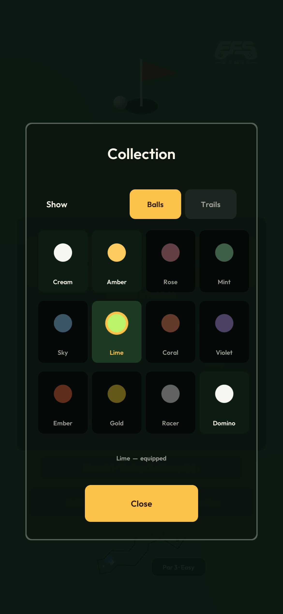
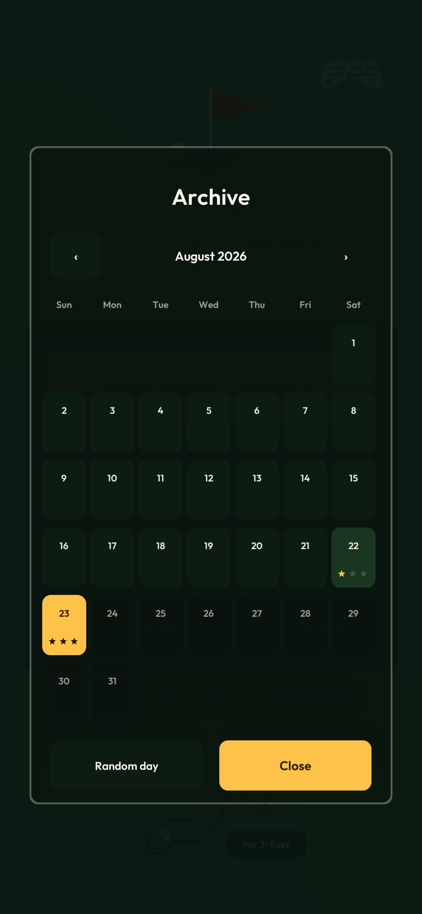

# PUTTSEED

[](https://github.com/emirsakal/PUTTSEED/actions/workflows/ci.yml)
[](https://emirsakal.github.io/PUTTSEED/)

**One mini-golf hole per day. Everyone on Earth plays the same course.**

<p align="center">
  <a href="https://emirsakal.github.io/PUTTSEED/"></a>
</p>

### ▶ [Play today's hole in your browser](https://emirsakal.github.io/PUTTSEED/)

No install, no account. The WebGL build is not a demo version — it runs the
same simulation the phone does, because a mouse drag and a finger drag reach
the quantizer as the same two integers, and the core has no floats to
disagree about. Progress lives in that browser only.

PUTTSEED is a daily-seed, bit-deterministic 2D mini-golf game for Android
(Unity 6 + a pure C# core). Each UTC day derives a seed; the seed generates a
course that is machine-verified solvable before any player sees it; and
because the physics is fixed-point and fully deterministic, a finished run
compresses to a ~30-character code that replays the exact same shots on any
device — no backend, no accounts, no uploads.

```
PUTTSEED day 214 — 3 strokes (par 3)
⬜🟫⛳
🔥 12-day streak
Watch: PUTT-BGUAAAAAAAAAAiD8AwDg_gEA
```

One glyph per stroke — what the ball met on its way: a bank off a wall,
sand, the cup. The code proves the run; the row is the part a stranger can
read.

<table>
  <tr>
    <td align="center"></td>
    <td align="center"></td>
    <td align="center"></td>
  </tr>
  <tr>
    <td align="center"><b>Today's hole</b><br>one course, everyone</td>
    <td align="center"><b>The elements</b><br>ice, bumpers, portals, water</td>
    <td align="center"><b>The day closes</b><br>your first finish is the answer</td>
  </tr>
  <tr>
    <td align="center"></td>
    <td align="center"></td>
    <td align="center"></td>
  </tr>
  <tr>
    <td align="center"><b>Journey</b><br>100 curated seeds</td>
    <td align="center"><b>Collection</b><br>earned, never sold</td>
    <td align="center"><b>The archive</b><br>every past day regenerates</td>
  </tr>
</table>

## A course, as the debug viewer prints it

```
       #                    seed        3
      ###                   par         2   difficulty Hard
     ##  #                  walls       10
    ##    #                 bumpers 2 · sand 2 · ice 2 · water 1
   #       #
  #   S    ##               S ball start
  #         ##              H hole
   #         ##             # wall      o bumper
   ##         #             : sand      * ice     ~ water
    ##        #
     ##   *oo~#
      #****oo~##
      ##***oo~~#
       #***~~~~#
       #*****  ##
       #**     :##
        #     :o:##
        #    :oo::#
        ##   :oo:::#
         ##   ::::::#####
          ##   :::: *** #
           #    ::  *** #
            #       *** #
             #      :H: #
             ##     ::: #
              ##    ::: #
               #    ::: #
                #########
```

`dotnet run --project tools/CourseViewer -c Release -- <seed|yyyy-mm-dd>`

## Architecture

```
+--------------------------------------------------------------+
|  Unity layer (repo root: Assets/)                            |
|  rendering · drag input · UI · audio/haptics · interpolation |
|                                                              |
|  InputQuantizer   -> drag becomes a 10-bit angle + 8-bit     |
|                      power index — THE quantization boundary |
|  FixView          -> Fix64 becomes float — render-only,      |
|                      one-way, never flows back               |
|  FixedStepper     -> frame time becomes whole 120 Hz ticks   |
+--------------------------------------------------------------+
|  core/src/PuttSeed.Core (netstandard2.1 — ZERO UnityEngine)  |
|                                                              |
|  FixedMath   Fix64 (Q32.32) · Vec2Fix · xorshift128 RNG ·    |
|              committed 1024-entry sine table                 |
|  Sim         GolfSim: 120 Hz fixed tick, circle-segment      |
|              walls with sub-stepping, bumpers, sand, ice,    |
|              water, gates, ramps, portals, windmills, hole   |
|              capture, rest, FNV-1a StateHash                 |
|  CourseGen   corridor growth -> hazard decoration ->         |
|              SolvabilityChecker (bounded BFS over the        |
|              quantized shot space) -> DifficultyRater;       |
|              versioned configs freeze published courses      |
|  Replay      [seed + timed shots] <-> PUTT- base64url codes  |
|  Daily       UTC date -> seed (FNV-1a + SplitMix64, salted)  |
+--------------------------------------------------------------+
```

The Unity project sits at the repo root; core sources are linked into
`Assets/PuttSeedCore/src` via a directory junction under an asmdef with
`noEngineReferences: true`, so the compiler itself enforces the layering.
(Unity writes `.meta` files into `core/src` through that junction; they are
committed for stable asset GUIDs and are inert to `dotnet build` and the
purity grep — the C# sources themselves stay UnityEngine-free.)

## The determinism proof

The whole product depends on one property: **the same seed and the same
inputs produce the same bits on every device.** That claim is enforced
mechanically, not by care:

- **No floats exist in core.** `scripts\check-purity.bat` scans `core/src`
  for `float`, `double`, `System.Random`, `DateTime` and `UnityEngine` and
  fails the build if any appear in code — comments and string literals are
  blanked first, because the check used to be a grep and a grep matched the
  comment explaining that floats are banned. It runs its own self-test in CI:
  a guard nobody has watched fail is not known to work. All math is `Fix64` —
  Q32.32 fixed point on `long`, with 128-bit multiply intermediates and Newton
  square root. Trig is a committed 1024-entry table; angles only ever exist as
  table indices.
- **The 10k-tick golden hash** (`DeterminismTests`): a fixture course
  holding every element — walls, bumpers, sand, ice, water, gates,
  ramps, portals and windmills — runs a scripted 16-shot, 10,000-tick
  session twice in-process, and the final FNV-1a state hash must equal a
  committed constant: `11426007175965104957`. Any accidental change to
  sim math fails it. A companion test guards the guard: removing any one
  element must move the hash, so nothing can sit in the fixture without
  being met. That test found two elements the previous fixture never
  touched, water among them.
- **Golden replay fixtures** (`GoldenReplayTests`): three seeds run
  end-to-end — generate, replay the author solution — against frozen final
  hashes and frozen `PUTT-` codes, on BOTH the generator the game ships
  (v4) and the frozen v1 one: a version byte that was ever emitted has to
  keep decoding forever.
- **The 1000-seed property suite** (`PropertySuiteTests`): every seed
  generates within bounded attempts, every accepted course's author solution
  replays to a capture within par, and every replay code round-trips.
- **Quantization boundary tests** (Unity EditMode): the drag-to-ShotInput
  mapping and the frame-time-to-ticks stepper are tested where analog meets
  discrete; floats stop existing at that line.
- **A replay that desyncs is a bug by definition** — the codec stores only
  `(seed, shots)`, plus the blade phase each shot was taken at once
  windmills started turning while the ball rests; playback is
  re-simulation, never recorded motion.

## Running things

| What | How |
|---|---|
| Core test suite (293 tests) | `dotnet test core` — or `scripts\test.bat` (purity grep + Release run) |
| Unity EditMode tests (178 tests) | `scripts\unity-tests.bat` |
| ASCII course viewer | `dotnet run --project tools/CourseViewer -c Release -- 3 --stats` |
| Screenshot for the README | Play mode, then **F9** (`PuttSeed → Capture Screenshot`) — works mid-drag, which the menu does not |
| Hero animation | Play mode, then **F10** to record a take, then `python tools/make-gif.py --list` and `--take take-NN` |
| Debug Android build | `scripts\build-android.bat` (`apk` arg for an installable APK) |
| Release .aab (signed) | `scripts\build-release.bat` |
| WebGL demo | `scripts\build-webgl.bat`, then `scripts\deploy-webgl.bat push` |

Requirements: .NET SDK 8, Unity 6000.3.x with the Android module (open the
repo root in Unity Hub).

### Typography

The game is set in **Outfit SemiBold**. Six OFL candidates live in
`Assets/PuttSeed/UI/Fonts/Library/`; `Fonts/active.txt` names the one in
use, and changing that line plus **PuttSeed → Rebuild Scenes** re-sets the
whole UI. Two of the six failed the audition — one has no right arrow, one
has no Turkish ğ/İ/ş — so `UiFontTests` asserts the active face can print
every character the UI can show, in both languages.

### Signing (release builds)

Create `keystore.properties` in the repo root — it is gitignored and must
never be committed:

```
storeFile=puttseed.keystore
storePassword=<store password>
keyAlias=puttseed
keyPassword=<key password>
```

Generate a keystore once with:

```bash
keytool -genkeypair -v -keystore puttseed.keystore -alias puttseed -keyalg RSA -keysize 2048 -validity 10000
```

`scripts\build-release.bat` picks it up automatically and warns loudly if it
builds unsigned.

## Game rules in one breath

Drag to aim (slingshot or direct — your pick), release to shoot; ball must
rest before the next stroke. Walls bounce, bumpers boost, sand drags, ice
slides, water costs a stroke and a reset; gates let you through one way
only, ramps push, portals teleport, and windmill blades sweep whether or
not you are ready. One day in eighteen adds a twist of its own — ice
underfoot, springier bumpers, or a crosswind — proven solvable under the
twist before it ships. Capture needs a slow ball over the cup — fast
attempts rim out. A hole is worth two strokes or three, and which one is
the generator's answer, proven before you see it. Stroke limit is par + 3;
holing out scores stars — 3 at par or better, 2 one over, 1 within the
limit. Retries are unlimited, but **the day's answer is your first
finish** — a score reached on the thirty-fourth attempt is nobody else's
score. Feel tuning lives in one ScriptableObject
(`Assets/PuttSeed/Resources/FeelConfig.asset`).

## Five modes, one generator

- **Daily** — the headline mode: one UTC hole, identical worldwide, with a
  local streak. Your best run rides along as a translucent ghost on the next
  attempt, and the archive is a month calendar you can page back through —
  every past day reopens, scored, because courses regenerate from the date
  alone and browsing history needs no storage. A random-day button picks an
  unplayed date for you.
- **Gauntlet** — last week's seven dailies played as one round, strokes
  cumulative, one score. It ships no new content by design: the holes are
  dailies that already existed. A gauntlet is named by its week index, so
  everyone runs the same seven, and only fully elapsed weeks open — a week
  still in progress would hand one player courses another has not reached.
  A round shares as a `PUTTWK-` code.
- **Journey** — a 100-level campaign of curated seeds, unlocked in order,
  three stars per level. Levels are literally just seeds, picked from
  generator scans on a ramp that climbs three axes at once: hazards,
  rated difficulty, and par. Par 3 is one level in five at the start and
  four in five at the end — weighted, never staged, so the two lengths stay
  interleaved the whole way. The solvability proof and the replay codec
  apply unchanged.
- **Practice** — unlimited courses by difficulty (Easy / Normal / Hard),
  per-difficulty personal bests, an undo mulligan, and course invites: any
  course shares as a code a friend can play on their own device.
- **Tutorial** — five fixed courses covering all nine elements: related ones
  share a lesson, so a pair is one sentence rather than two facts. The first
  launch walks straight into them. Each seed is held to its lesson by a test —
  the course must carry exactly the elements the hint names and nothing else,
  every element must be taught somewhere, and no lesson may be a themed day.

## Meta — local by design

No backend, no accounts, no IAP. Everything below lives in the local save
and travels between devices as a single `PUTTSAVE-` code (export/import in
the stats panel):

- thirteen achievements, plus a stats panel with a stroke-distribution
  histogram;
- cosmetics on two axes — twelve ball skins (colour, plus a stripe and a
  dot pattern) and eight trails (tint, plus a comet and a bubble style) —
  gated by achievements and Journey progress. The Collection grid spells out
  each locked item's condition; nothing is for sale;
- watchable replays: paste any `PUTT-` code to watch that run in-game;
- EN/TR localization, and settings for sound, haptics, aim style, a
  colorblind palette and a 60/120 FPS battery mode;
- every sound is synthesized: the 16 WAV clips are generated by a committed
  editor tool (`SfxSynth`) — zero recorded audio in the repo.

Out-of-scope ideas live in [LATER.md](LATER.md) — deliberately.

## The paper trail

Everything that shaped the build is committed, including the parts that
argue with it:

| Document | What it holds |
|---|---|
| [docs/GDD.md](docs/GDD.md) | the design — rules, scoring, modes, and the explicit non-goals |
| [docs/ARCHITECTURE.md](docs/ARCHITECTURE.md) | the layering, and why the compiler is what enforces it |
| [docs/AUDIT.md](docs/AUDIT.md) | a studio-style audit of this game: scorecard, competitor teardown, costed proposals, and a cut list |
| [docs/STATUS.md](docs/STATUS.md) | measured numbers — including the rows still honestly marked NOT YET MEASURED |
| [docs/ROADMAP.md](docs/ROADMAP.md) | the phase plan the work followed |
| [docs/store/](docs/store/) | Play listing copy in EN and TR, and the privacy policy |
| [LATER.md](LATER.md) | the idea parking lot: nothing here is planned, which is the point |

## Workflow note

This repo was built with an AI-assisted workflow (Claude Code); the phase
prompts that drove each week's work are committed verbatim in
[prompts/PROMPTS.md](prompts/PROMPTS.md). The guardrails those prompts
enforce — TDD for the core, the purity grep, committed golden hashes — are
exactly what makes an AI-assisted codebase auditable: correctness is proven
by machine-checked tests, not by trust in the author, human or otherwise.

## License

[MIT](LICENSE).
